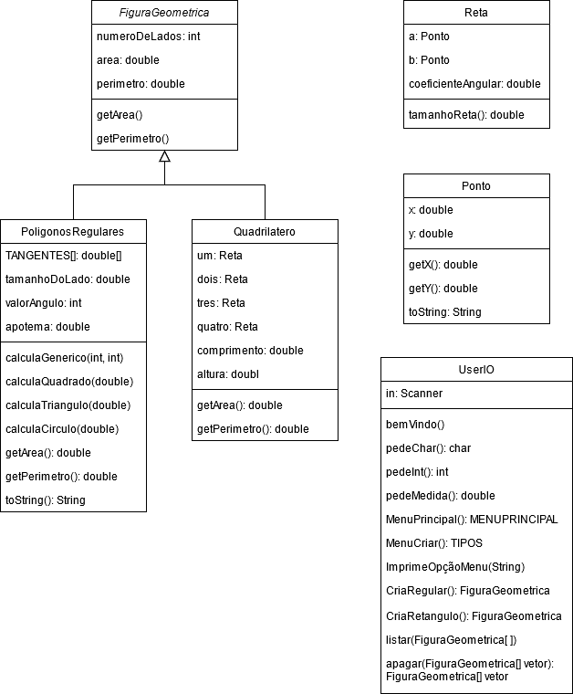
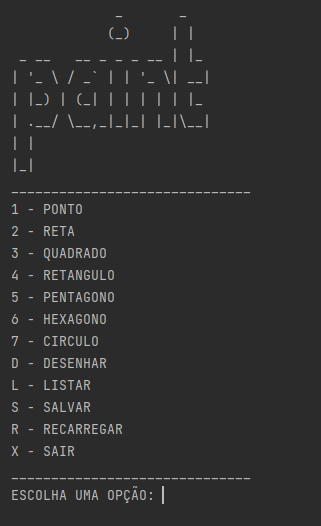
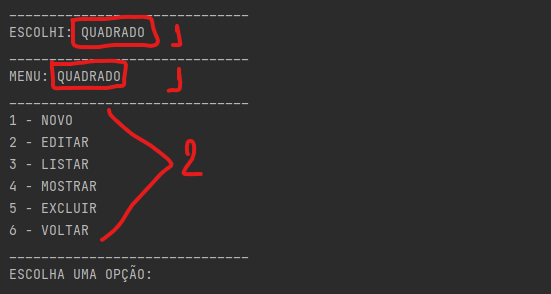
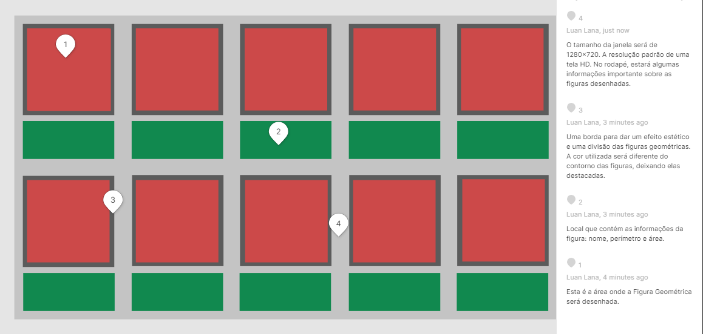
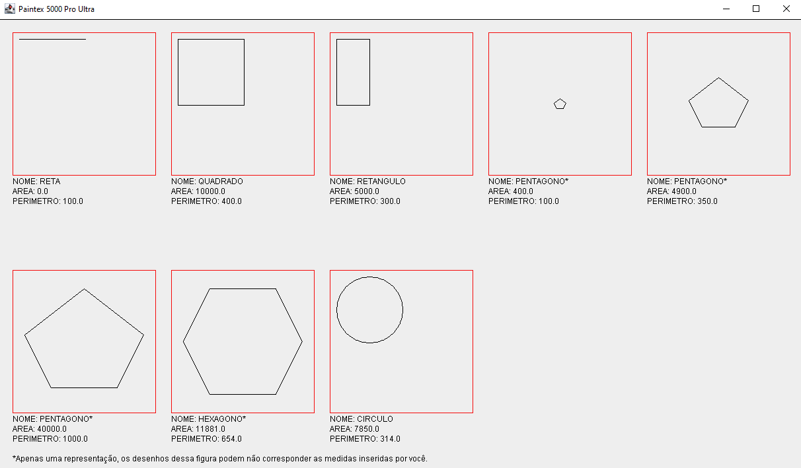
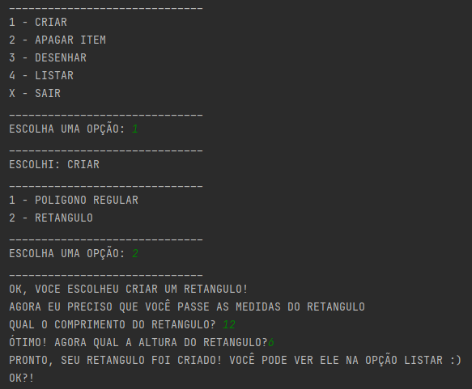
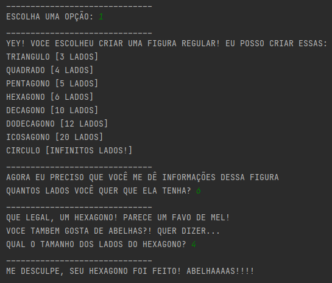

<h1> RELATÓRIO DO TP1 </h1>

<h4> Você fez uso do conceito de sobrecarga de funções? Onde?  </h4>  

>Não tive a necessidade de usar sobrecarga.

<h4> Você fez uso do conceito de Herança de funções? Onde? Você vê que houve benefícios?</h4>

>Sim, <code>Quadrilatero.java</code> e <code>PoligonosRegulares.java</code> herdam <code>FiguraGeometrica.java</code>.
> No entanto seria interessante criar outras classes como <code>Circulo.java</code>, <code>Triangulo.java</code> e
> <code>Quadrado.java</code> herdassem de uma classe genérica que tornasse a criação dessas figuras mais limpa.

<h4> Você fez uso da função super() em construtores mesmo que indiretamente? Onde?</h4>

>Não teve o uso do <code>super()</code> nos contrutores já que figura geométrica é Abstrato e os métodos só possuem a assinatura.

<h4> Você fez uso da função this() em construtores mesmo que indiretamente? Onde?</h4>

>Não tive a necessidade de usar <code>this()</code>.

<h4> Você fez uso de sobreescrita de funções? onde? só de Object ou de alguma função sua mesmo?</h4>

>O único uso de sobrescrita foi de <code>toString()</code>

<h4> Qual o benefício do uso de classes ENUM?</h4>

>A leitura do código e evita erros já que as opções são limitadas a quantitade de elementos no ENUM.

<h4> Cole a imagem do diagrama de classe do seu sistema e faça um paragrafo se você entende este diagrama e 
ele representa realmente objetos do mundo real, com nomes de Metodos coerentes.</h4>

>Alguns métodos como <code>listar()</code> e <code>apagar()</code> deixam abrangentes o que eles listam. Um outro método
> que poderia ser renomeado é o método <code>pedeMedida()</code> para <code>pedeDouble()</code>.
>
>

<h4> Você fez uso da palavra Protected? Ela foi relevante onde?</h4>

>Sim, apenas no Scanner. Não teve muita relevancia já que dentro do pacote <code>view</code> não tem outra classe "ativa".

<h1> RELATÓRIO DO TP2 & 3 </h1>

<h4> Você acredita que o correto uso da Orientação à objetos traz mais benefícios ao seu código fonte?</h4>

>Com toda certeza, o código fica muito mais legivel, organizado e facil de dar manutenção. Além de quando usado para trabalho em equipes,
> ser muito facil de unir o trabalho de todos em um só.

<h4> O que é o tratamento de exceções e porque ele é necessário para a organização da transmissão de mensagens entre classes?</h4>

>O tratamento de excessões é essencial para evitar que o programa tenha algum mal funcionamento ou pare de executar. É muito interessante também para
> dizer ao usuario o que aconteceu com o software. Caso a classe não seja adequada para se comunicar com o usuário, você pode utilizar do
> recurso do throws para outra classe tratar a excessão e informar os problemas ao usuário.

<h4> Porque o uso de interfaces é útil no lugar do uso de Herança Multipla?</h4>

> A herança faz com que as classes herdem da classe pai os métodos, e caso sejam diferentes, elas tem que sobrescrever o método
> da classe pai, já na interface, as classes devem obrigatoriamente ter os métodos da interface que elas implementam, no entando,
> os metodos são próprios de cada classe.

<h4> Você tem alguma classe que usa extends e implements simultaneamente? se sim qual a justificativa para isso no modelo do seu trabalho?</h4>

> Ela herda métodos que são identicos pra todas classes filhas e as mesmas implementam métodos que são diferentes em cada uma delas,
> e são forçadas já que a interface as obriga.

<h4> O que é UML e dentre os possíveis diagramas existentes, cite 3 que poderiam ser úteis para descrever o seu projeto prático desta disciplina.</h4>

>UML é Unified Modeling Language é um diagrama onde você consegue consegue ter uma ideia e montar o projeto antes de começar a escreve-lo
> de fato, o que torna muito mais eficiente e reduz erros e tempo perdido escrevendo codigos desnecessários. Seriam uteis para descrever o projeto prático:
> Diagrama de Classes, Diagrama de objetos e Diagrama de componentes.

<h4> Qual foi o benefício sobre a visão de "Legibilidade" do código fonte? E sobre "organização" das classes?
Do seu protótipo até esta etapa você acabou fazendo uso de comportamentos Polimórficos no seu trabalho prático.</h4>


> Bom, na maioria dos casos foi bastante interessante pois reduz bastante a quantidade de código escrita em muitas classes. No entanto,
> em algumas classes fica dificil dizer quais metodos foram herdados por ela para se ter que sobrescrever quando necessario.


<h1> RELATÓRIO DO TRABALHO PRÁTICO FINAL </h1>

> <h2>Ideias-Chaves</h2>
>
>A ideia inicial que tive era de fazer um programa com uma classe genérica de Poligonos Regulares, essa classe em teoria geraria
> figuras geometricas de N lados. O usuário informaria a quantidade de lados e o tamanho do lado da figura que ele criasse: 
> o programa calcularia a area e o perimetro de todas essas figuras, "fatiando elas em triangulos" e calculando a area deles. Porém, desenhar essas figuras com
> interface gráfica demandaria saber exatamente os pontos {X,Y} dessas figuras(que nem sempre seriam valores inteiros), por isso essa ideia foi deixada de lado.
> 
> Como não há mais no software figuras com N lados, os pontos X,Y não são utilizados, apenas o tamanho dos lados da figura. Então,
> as classes Reta e Ponto são tratadas como figuras geometricas, e não tem uma função diretamente ligada com calcular a area, perímetro e desenhar
> de fato as figuras.
> 
> Mas o código de criação de Figuras com Retas e Pontos ainda se manteve em classes como Quadrilátero, Quadrado (e em Pentagono, mas de forma genérica).
> 
> O programa agora tem uma limitação de figuras geometricas dentre as quais o usuário escolhe criar, editar as já criadas, listar, e desenhar.
> 
> O esquema de menus e organização das funções é um pouco diferente do projeto em sala, aqui a classe <code> Menus.java </code>, contém
> tanto o menu principal quanto os menus de cada figura geométrica, sendo o "menu de cada figura geometrica" o mesmo menu para todas, o que realmente muda é
> o nome do menu se altera baseado no tipo de figura que se está trabalhando com.
> 
> Um outro ponto importante é que funções como listar, apagar, mostrar e selecionar uma figura são processo idênticos para todas as figuras geométricas, logo, 
> cada "controller" de figura extende um "controller" genérico que se aplica em todas.
> 
>   <h2>Classes</h2>
> 
> A classe principal e "genérica" é a <code> FiguraGeometrica </code> que são os dados de que o sistema gira em volta:
> lados, tipo, area e perímetro de uma Figura Geométrica e seus respectivos métodos get/set.
> 
> A classe secundária e também "genérica" é a de <code> Poligonos Regulares </code>, que são Figuras Geométricas que possuem lados de mesmo tamanho,
> mas possuem quantidade de lados diferentes. Essa classe é usada para as classes que se configuram como Poligonos Regulares
> extenderem atributos e métodos que todas compartilham entre si.
>
>
> 
> <h2>Controllers, Views e ENUMS</h2>
> 
> Essa é a parte de funcionamento do programa de fato, que o programa pergunta coisas ao usuário, faz seus calculos armazena os dados, mostra o resultado
> ao usuário e desenha figuras.
> 
> De forma resumida, o programa mostra uma lista de figuras geométricas e opções, como essa abaixo:
> 
> 
> 
> Quando se seleciona uma das figuras geometricas, é criado um objeto da respectiva da Figura Geometrica generico, sem valores
> e ele é enviado para criar um menu da figura geometrica, esse é usado para informar o tipo de figura geometrica para dar o titulo do menu(representado pelo numero 1)
> 
> É tambem mostrado ao usuário outra lista com opções liagas aquela figura geometrica(representado pelo numero 2).
> 
> 
> 
> O usuário pode criar figuras geométricas, no máximo 10, editar essas figuras, listar figuras do mesmo tipo, mostrar detalhes sobre ela e excluir uma figura da lista de figuras.
> 
> Para se criar um quadrado, por exemplo, o usuário seleciona QUADRADO, NOVO, informa o tamanho do lado dos quadrados e pronto.
> Esse quadrado é guardado num vetor de figuras.
> 
> A comunicação entre os Controllers e View é feito por meio de ENUMS.
> 
> <h2>Arquivo</h2>
> 
> O usuário pode salvar e recarregar figuras geométricas do seu computador, isso é feito por meio do <code> dao.FiguraGeometrica.java </code> que gera um arquivo - com o nome (criativo) de <code> arquivo.dat</code>.
> 
> <h2>Interface Gráfica</h2>
> 
> A interface gráfica basicamente é composta por dez módulos, e cada módudo por dois segmentos menores. Cada módulo se refere
> a uma figura geometrica na lista de figuras. Dentro de um módulo tem uma area para desenhar a Figura, e os dados da Figura, como
> nome, area e perímetro. Segue abaixo um modelo criado no Figma:
> 
> 
>
> Sobre o desenho dos pentagonos e hexagonos: para desenhar essas figuras utilizando a classe Graphics é complexo, pois você
> precisa fazer um calculo para definir as coordenadas de cada vertice dessas figuras no "plano cartesiano".
>
> Para representar essas figuras na interface grágica fiz o desenho
> de um Pentagono e um Hexagono em um plano cartesiado, coletei os pontos e é impresso o mesmo pentagono e hexagono independente dos
> valores da figura informado. Porém, eles sofrem reduções de escala caso as medidas sejam muito grandes, médias ou pequenas.
>
> O que define se o pentágono é grande, médio ou pequeno é o tamanho do lado: caso seja maior que metade do lado de um módulo da interface: ele é grande. Se for menor que
> um quarto de módulo da interface gráfica, ele é pequeno. Caso seja um valor intermediário entre esses dois: ele é médio.
>
>Abaixo temos um exemplo disto com os pentágonos:
> 
> 
> 
> Sobre os PONTOS: Pontos são figuras que possuem 0 dimensões, logo não incluí os pontos para serem desenhados.
> 
> <h2>Principais pontos de mudanças</h2>
> 
> A principal mudança, sem duvidas é a de não suportar figuras geométricas de n lados (do triangulo ao circulo) desde que elas fossem Poligonos Regulares.
> 
> Já que o programa não suportava N tipos de poligonos regulares, a ideia era ter uma gama de diferentes Poligonos Regulares para o usuário escolher.
> Mas como na maioria delas o desenho seria complexo ou impossivel utilizando somente Graphics, o numero de poligonos regulares foi reduzido para quatro:
> Hexagono, Pentagono, Quadrado, e Circulo. 
> 
> Outra grande mudança foi não ter dois submenus: um para figuras regulares e não-regulares. Sendo assim, a quantidade de 
> poligonos não regulares também foi reduzida, mantendo somente um representante: o Retângulo.   
> O motivo é bem simples: desenhar figuras geometricas não regulares utilizando somente Graphics seria muito dificil, levando em conta
> que o método <code> drawPolygon()</code> aceita somente valores inteiros para os pontos do plano cartesiano.
> 
> Menu principal e menu da figura geométrica do Retangulo no antigo programa.
> 
> 
> 
><h3>Interação com o Usuário</h3>
> 
> A interação com usuário no começo do projeto era uma experiências muito mais rica, cheia de humor e frases que davam uma vida
> a mais ao software, mas escrever linhas de texto para cada figura - além de custar muito tempo - ocupa muito espaço no terminal.
> Com a drástica mudança no código esse "dialogo" com o usuário foi se perdendo.
> 
> Exemplo de interação com o usuário na hora de se criar um Hexagono no antigo programa:
> 
> 
> 
>
```diff
Turma: PC2 - 2021 1
Professor: Aléssio
Aluno: Luan Lana Maia
```


