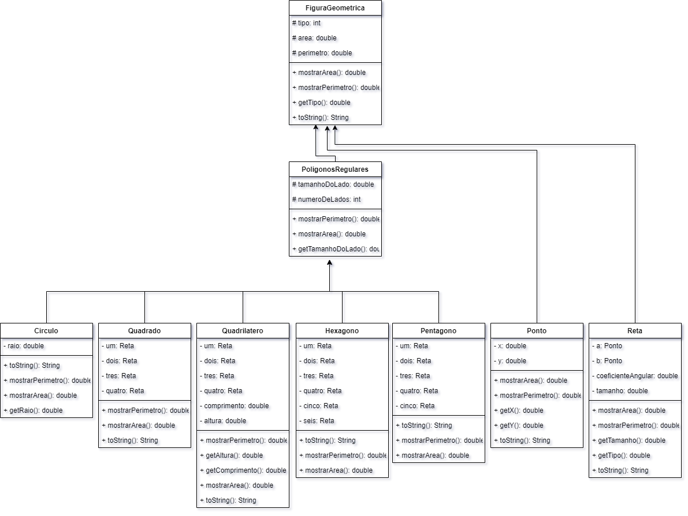

<h1> RELATÓRIO DO TP1 </h1>

<h4> Você fez uso do conceito de sobrecarga de funções? Onde?  </h4>  

>Não tive a necessidade de usar sobrecarga.

<h4> Você fez uso do conceito de Herança de funções? Onde? Você vê que houve benefícios?</h4>

>Sim, <code>Quadrilatero.java</code> e <code>PoligonosRegulares.java</code> herdam <code>FiguraGeometrica.java</code>.
> No entanto seria interessante criar outras classes como <code>Circulo.java</code>, <code>Triangulo.java</code> e
> <code>Quadrado.java</code> herdassem de uma classe genérica que tornasse a criação dessas figuras mais limpa.

<h4> Você fez uso da função super() em construtores mesmo que indiretamente? Onde?</h4>

>Não teve o uso do <code>super()</code> nos contrutores já que figura geométrica é Abstrato e os métodos só possuem a assinatura.

<h4> Você fez uso da função this() em construtores mesmo que indiretamente? Onde?</h4>

>Não tive a necessidade de usar <code>this()</code>.

<h4> Você fez uso de sobreescrita de funções? onde? só de Object ou de alguma função sua mesmo?</h4>

>O único uso de sobrescrita foi de <code>toString()</code>

<h4> Qual o benefício do uso de classes ENUM?</h4>

>A leitura do código e evita erros já que as opções são limitadas a quantitade de elementos no ENUM.

<h4> Cole a imagem do diagrama de classe do seu sistema e faça um paragrafo se você entende este diagrama e 
ele representa realmente objetos do mundo real, com nomes de Metodos coerentes.</h4>

>Alguns métodos como <code>listar()</code> e <code>apagar()</code> deixam abrangentes o que eles listam. Um outro método
> que poderia ser renomeado é o método <code>pedeMedida()</code> para <code>pedeDouble()</code>.
>
>

<h4> Você fez uso da palavra Protected? Ela foi relevante onde?</h4>

>Sim, apenas no Scanner. Não teve muita relevancia já que dentro do pacote <code>view</code> não tem outra classe "ativa".

<h1> RELATÓRIO DO TP2 & 3 </h1>

<h4> Você acredita que o correto uso da Orientação à objetos traz mais benefícios ao seu código fonte?</h4>

>Com toda certeza, o código fica muito mais legivel, organizado e facil de dar manutenção. Além de quando usado para trabalho em equipes,
> ser muito facil de unir o trabalho de todos em um só.

<h4> O que é o tratamento de exceções e porque ele é necessário para a organização da transmissão de mensagens entre classes?</h4>

>O tratamento de excessões é essencial para evitar que o programa tenha algum mal funcionamento ou pare de executar. É muito interessante também para
> dizer ao usuario o que aconteceu com o software. Caso a classe não seja adequada para se comunicar com o usuário, você pode utilizar do
> recurso do throws para outra classe tratar a excessão e informar os problemas ao usuário.

<h4> Porque o uso de interfaces é útil no lugar do uso de Herança Multipla?</h4>

> A herança faz com que as classes herdem da classe pai os métodos, e caso sejam diferentes, elas tem que sobrescrever o método
> da classe pai, já na interface, as classes devem obrigatoriamente ter os métodos da interface que elas implementam, no entando,
> os metodos são próprios de cada classe.

<h4> Você tem alguma classe que usa extends e implements simultaneamente? se sim qual a justificativa para isso no modelo do seu trabalho?</h4>

> Ela herda métodos que são identicos pra todas classes filhas e as mesmas implementam métodos que são diferentes em cada uma delas,
> e são forçadas já que a interface as obriga.

<h4> O que é UML e dentre os possíveis diagramas existentes, cite 3 que poderiam ser úteis para descrever o seu projeto prático desta disciplina.</h4>

>UML é Unified Modeling Language é um diagrama onde você consegue consegue ter uma ideia e montar o projeto antes de começar a escreve-lo
> de fato, o que torna muito mais eficiente e reduz erros e tempo perdido escrevendo codigos desnecessários. Seriam uteis para descrever o projeto prático:
> Diagrama de Classes, Diagrama de objetos e Diagrama de componentes.

<h4> Qual foi o benefício sobre a visão de "Legibilidade" do código fonte? E sobre "organização" das classes?
Do seu protótipo até esta etapa você acabou fazendo uso de comportamentos Polimórficos no seu trabalho prático.</h4>

> Bom, na maioria dos casos foi bastante interessante pois reduz bastante a quantidade de código escrita em muitas classes. No entanto,
> em algumas classes fica dificil dizer quais metodos foram herdados por ela para se ter que sobrescrever quando necessario.